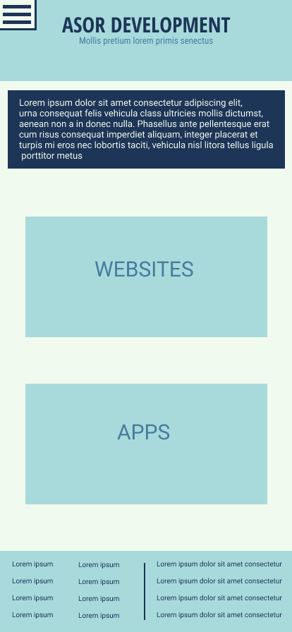

# Asor-Development

[Deployed Site](https://website-gilt-two.vercel.app/)

______________________
## Mobile Version 1

  

#### Main Features
- Hamburger Menu
- Caousel
_________________________
### Design
##### Color Scheme

| Color                                                         | Code    | Sass Variable  |
| ------------------------------------------------------------- |:-------:| :-------------:|
| | #F1FAEE | --color-one    |
| | #457B9D | --color-two    |
| | #A8DADC | --color-three  |
| | #1D3557 | --color-four   |

### Tech Stack
- [React]()    
    - Installed react, react-dom, and react-scripts with cra-template.
- [Sass]()   
    - `npm install node-sass`
    - [CSS Reset](https://meyerweb.com/eric/tools/css/reset/)
- [ReactStrap](https://reactstrap.github.io/)   
    - `npm install --save reactstrap react react-dom`
    - `npm i bootstrap`
- [Font Awesome](https://fontawesome.com/how-to-use/on-the-web/using-with/react)   
    - `npm i --save @fortawesome/fontawesome-svg-core`
    - `npm install --save @fortawesome/free-solid-svg-icons`
    - `npm install --save @fortawesome/react-fontawesome`
    - `npm install --save @fortawesome/free-brands-svg-icons`
    - `npm install --save @fortawesome/free-regular-svg-icons`